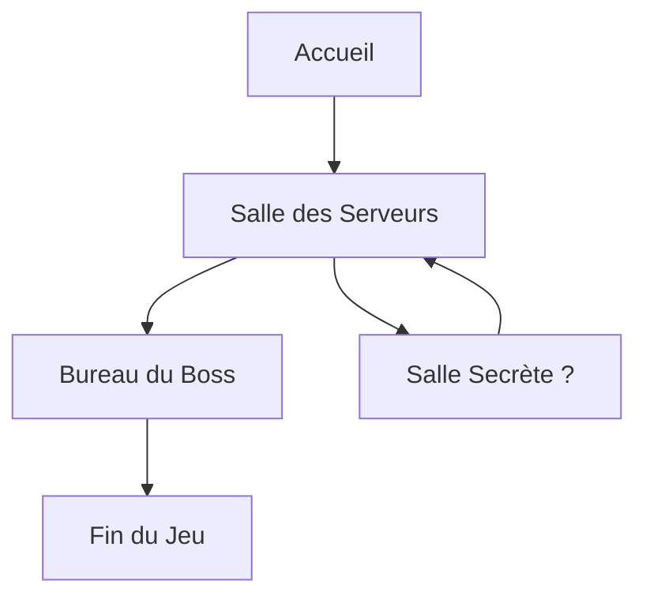

# 🌀 Labyrinthe : Un CTF en Binôme


#ctf #cybersecurity #teamwork #hacking

> [!NOTE] Introduction
> Bienvenue dans le Labyrinthe, un Capture The Flag (CTF) unique en son genre ! Préparez-vous à plonger dans un monde virtuel où l'ingéniosité, l'humour et la coopération seront vos meilleures armes. Que vous soyez l'Architecte ou le Ninja, votre mission est claire : créer, explorer et sécuriser ce labyrinthe digital. Alors, êtes-vous prêt à relever le défi ?
## Table des matières

- [[#🎭 Rôles]]
- [[#🏗️ Structure du Jeu]]
- [[#🕷️ Vulnérabilités Cachées]]
- [[#🗺️ Carte du Labyrinthe]]
- [[#🏆 Objectifs pour le Ninja du Clavier]]
- [[#📜 Règles d'Or]]
- [[#📘 Le Carnet de Solutions]]
- [[#📚 Glossaire]]
- [[#❓ FAQ]]
- [[#🎉 Conclusion]]

## 🎭 Rôles

|                              L'Architecte                              |                             Le Ninja                              |
| :--------------------------------------------------------------------: | :---------------------------------------------------------------: |
|  |  |
|             Créateur du labyrinthe et gardien des secrets              |       Hacker en herbe, prêt à tout pour percer les mystères       |

> [!TIP] Astuce pour l'Architecte
> Pensez comme un hacker pour mieux vous défendre. Chaque vulnérabilité que vous cachez est une leçon en puissance.

> [!TIP] Astuce pour le Ninja
> La patience est votre alliée. Observez, analysez, puis agissez. Rappelez-vous : même le plus petit détail peut cacher un grand secret.
> 

> [!INFO] Front-end
> Un labyrinthe virtuel (HTML/JS/Go/Py peu importe) aussi simple qu'un rubik's cube pour daltoniens.

> [!TIP] Thème
> Totalement libre, mais une pointe d'humour est de rigueur.

> 💡 *"La simplicité est la sophistication suprême"* - Léonard de Vinci


## 🕷️ Vulnérabilités Cachées (🤫)

<details>
  <summary><strong>1. 🕸️ XSS - Cross-Site Scripting</strong></summary>
  
  ### "Injectez du rire dans le code !"
  > [!QUOTE] Indice
  > "Les commentaires sont la meilleure façon de documenter son code, n'est-ce pas ?"
  
  ```html
  <!-- Peut-être qu'un petit <script>alert('XSS')</script> ici passerait inaperçu ? -->
  ```
</details>

<details>
  <summary><strong>2. 🖱️ Clickjacking - L'Art de Tromper le Clic</strong></summary>
  
  ### "Cliquez ici pour ne PAS obtenir un million d'euros !"
  > [!QUOTE] Indice
  > "La transparence, c'est importante en politique... et en CSS !"
  
  ```css
  .piege {
    opacity: 0.01;
    position: absolute;
    top: 0;
    left: 0;
    width: 100%;
    height: 100%;
  }
  ```
</details>

<details>
  <summary><strong>3. 🔐 Broken Authentication - Qui es-tu vraiment ?</strong></summary>
  
  ### "Mot de passe : bm3. Non, ce n'est pas ma voiture !"
  > [!QUOTE] Indice
  > Le PDG de Sony s'est fait bruteforce son mot de passe en quelques secondes, sa voiture était bien une BMW M3 (2014)
  
  ```python
  weak_passwords = ['password', '123456', 'admin', 'bm3']
  ```
</details>

<details>
  <summary><strong>4. 🐞 Fuite de Données - Cherchez la Petite Bête</strong></summary>
  
  ### "Les secrets sont comme les pets, ils finissent toujours par sortir."
  > [!QUOTE] Indice
  > "Avez-vous vérifié les métadonnées de l'image présente ?"
  
  ```bash
  exiftool suspicious_image.jpg | grep "Secret"
  ```
</details>

<details>
  <summary><strong>5. 🚶‍♂️ Navigation Indésirable - Le Touriste Digital</strong></summary>
  
  ### "Bienvenue dans les backrooms du site !"
  > [!QUOTE] Indice
  > "Qui a besoin d'une carte quand on a '../' ?"
  
  ```
  https://example.com/users/profile/../../../confidential/secrets.txt
  ```
</details>

## 🗺️ Carte du Labyrinthe



> [!NOTE]
> Evidemment, vous n'êtes pas limités à 3 niveaux.
> Etant donné la nature labyrinthique de l'exercice, vous pouvez également prévoir des retours en arrière ou des "sauts temporels"


## 🏆 Objectifs pour le Ninja du Clavier

- [ ] Trouver et exploiter au moins 3 vulnérabilités
- [ ] Découvrir le secret ultime caché dans le labyrinthe (indice : ça implique des chats et de la cryptographie, évidemment)
- [ ] Agir avec Humour mais respect (dans la limite du possible)


## 📜 Règles d'Or

1. 🎨 La créativité est votre meilleure arme (après le café, bien sûr)
2. 😂 Riez de vos erreurs, elles sont probablement plus drôles que les blagues du boss
3. 👂 N'oubliez pas : dans ce labyrinthe, même les murs ont des oreilles (et probablement un sens de l'humour douteux)

> [!QUOTE]
> ☕ *"Je code, donc je suis"* - Descartes (s'il était développeur)

## 📘 Le Carnet de Solutions (Top Secret)

Pour chaque vulnérabilité, notez :

| Catégorie | Description |
|-----------|-------------|
| 🎭 Nom de code | Le nom le plus drôle possible |
| 🔍 Découverte | Par pur génie ou par accident ? |
| 🛠️ Exploitation | Plus c'est tordu, mieux c'est |
| 🩹 Correction | Ou pas, si vous voulez garder votre job de testeur |


## 📚 Glossaire

- **APT (Advanced Persistent Threat)** : Type d'attaque où un attaquant non autorisé accède à un réseau et y reste non détecté pendant une longue période.

- **Backdoor** : Point d'accès secret à un système, contournant les mécanismes normaux d'authentification.

- **Black Hat** : Hacker malveillant qui viole la sécurité informatique pour des gains personnels ou avec des intentions malveillantes.

- **Blue Team** : Groupe de sécurité qui défend une organisation contre les menaces de sécurité.

- **Botnet** : Réseau d'ordinateurs infectés contrôlés à distance par un attaquant.

- **Brute Force** : Méthode d'attaque consistant à essayer toutes les combinaisons possibles pour trouver un mot de passe ou une clé.

- **Buffer Overflow** : Vulnérabilité où un programme écrit plus de données dans un tampon qu'il ne peut en contenir.

- **CAPTCHA** : Test utilisé pour déterminer si l'utilisateur est un humain ou un bot.

- **Cheval de Troie** : Type de malware qui se présente comme un logiciel légitime mais cache des fonctionnalités malveillantes.

- **Clickjacking** : Technique visant à tromper un utilisateur en lui faisant cliquer sur quelque chose d'autre que ce qu'il croit.

- **Cross-Site Request Forgery (CSRF)** : Attaque forçant un utilisateur à exécuter des actions indésirables sur une application web où il est authentifié.

- **CTF (Capture The Flag)** : Type de compétition de sécurité informatique où les participants doivent trouver des "drapeaux" cachés dans des systèmes vulnérables.

- **DDoS (Distributed Denial of Service)** : Attaque visant à rendre un service en ligne indisponible en surchargeant le système avec du trafic provenant de multiples sources.

- **DNS Spoofing** : Attaque où des données DNS corrompues sont introduites dans le cache d'un résolveur DNS.

- **Escalade de privilèges** : Exploitation d'une faille pour gagner des droits d'accès plus élevés sur un système.

- **Exploit** : Code qui tire parti d'une vulnérabilité dans un système ou une application.

- **Firewall** : Système de sécurité réseau qui surveille et contrôle le trafic entrant et sortant.

- **Fuzzing** : Technique de test automatisé qui introduit des données invalides, inattendues ou aléatoires dans un système.

- **Hachage** : Processus de conversion d'une entrée de longueur arbitraire en une sortie de taille fixe.

- **Ingénierie sociale** : Manipulation psychologique pour amener des personnes à divulguer des informations confidentielles.

- **Injection SQL** : Technique d'attaque consistant à insérer du code SQL malveillant dans les requêtes d'une application.

- **Keylogger** : Logiciel ou dispositif qui enregistre les frappes au clavier.

- **Man-in-the-Middle (MITM)** : Attaque où l'attaquant s'insère secrètement dans une conversation entre deux parties.

- **Metasploit** : Framework open-source pour développer, tester et exécuter des exploits.

- **Nmap** : Outil de scan de réseau et d'audit de sécurité.

- **Payload** : Partie d'un malware qui exécute une action malveillante.

- **Phishing** : Tentative d'obtenir des informations sensibles en se faisant passer pour une entité de confiance.

- **Ransomware** : Type de malware qui chiffre les fichiers d'un utilisateur et demande une rançon pour les déchiffrer.

- **Red Team** : Groupe qui joue le rôle d'un adversaire pour tester la sécurité d'une organisation.

- **Reverse Engineering** : Processus d'analyse d'un système pour identifier ses composants et leurs relations.

- **Rootkit** : Collection de logiciels conçus pour permettre l'accès à un ordinateur tout en masquant sa présence.

- **Sandbox** : Environnement de test isolé pour exécuter du code potentiellement dangereux.

- **Script Kiddie** : Personne inexpérimentée qui utilise des scripts ou programmes existants pour attaquer des systèmes.

- **Sniffing** : Interception et analyse du trafic réseau.

- **Social Engineering** : Manipulation psychologique visant à obtenir des informations confidentielles.

- **Spear Phishing** : Attaque de phishing ciblée sur une personne ou une organisation spécifique.

- **Spoofing** : Usurpation d'identité dans le but de tromper des systèmes ou des utilisateurs.

- **Stéganographie** : Art de cacher des informations dans d'autres données ou fichiers.

- **Threat Intelligence** : Données analysées sur les menaces potentielles ou actuelles visant une organisation.

- **Virus** : Programme malveillant qui se réplique en s'insérant dans d'autres programmes.

- **VPN (Virtual Private Network)** : Technologie créant une connexion chiffrée sur un réseau moins sûr.

- **Wardriving** : Acte de rechercher des réseaux WiFi depuis un véhicule en mouvement.

- **White Hat** : Hacker éthique qui teste la sécurité avec la permission du propriétaire du système.

- **Worm** : Malware auto-répliquant qui se propage à travers les réseaux.

- **XSS (Cross-Site Scripting)** : Vulnérabilité web permettant l'injection de code côté client.

- **Zero-Day** : Vulnérabilité inconnue du fabricant du logiciel et du public, potentiellement déjà exploitée par des attaquants.

## ❓ FAQ

1. **Q: Puis-je participer seul ?**
   R: Le CTF est conçu pour être joué en binôme, mais rien ne vous empêche de relever le défi en solo !

2. **Q: Y a-t-il une limite de temps ?**
   R: Non, prenez le temps qu'il vous faut. L'important est d'apprendre et de s'amuser.

3. **Q: Où puis-je trouver plus de ressources sur la cybersécurité ?**
   R: Voici quelques liens utiles :
   - [OWASP](https://owasp.org/)
   - [HackTheBox](https://www.hackthebox.eu/)
   - [TryHackMe](https://tryhackme.com/)

## 🎉 Conclusion

Que le meilleur binôme gagne ! Et rappelez-vous, dans le monde de la cybersécurité, le ridicule ne tue pas, mais il peut certainement compromettre un système entier !

---

<div align="center">
  
  <p><em>Bonne chance, et que la force du code soit avec vous !</em></p>
</div>