# 🌀 Labyrinthe : Un CTF en Binôme


#ctf #cybersecurity #teamwork #hacking

> **Note:** Introduction
> Bienvenue dans le Labyrinthe, un Capture The Flag (CTF) unique en son genre ! Préparez-vous à plonger dans un monde virtuel où l'ingéniosité, l'humour et la coopération seront vos meilleures armes. Que vous soyez l'Architecte ou le Ninja, votre mission est claire : créer, explorer et sécuriser ce labyrinthe digital. Alors, êtes-vous prêt à relever le défi ?

## Table des matières

- [🎭 Rôles](#-rôles)
- [🕷️ Vulnérabilités Cachées](#️-vulnérabilités-cachées)
- [🗺️ Carte du Labyrinthe](#️-carte-du-labyrinthe)
- [🏆 Objectifs pour le Ninja du Clavier](#-objectifs-pour-le-ninja-du-clavier)
- [📜 Règles d'Or](#-règles-dor)
- [📘 Le Carnet de Solutions](#-le-carnet-de-solutions)
- [📚 Glossaire](#-glossaire)
- [❓ FAQ](#-faq)
- [🎉 Conclusion](#-conclusion)

## 🎭 Rôles

|                              L'Architecte                              |                             Le Ninja                              |
| :--------------------------------------------------------------------: | :---------------------------------------------------------------: |
|  |  |
|             Créateur du labyrinthe et gardien des secrets              |       Hacker en herbe, prêt à tout pour percer les mystères       |

> **Tip:** Astuce pour l'Architecte
> Pensez comme un hacker pour mieux vous défendre. Chaque vulnérabilité que vous cachez est une leçon en puissance.

> **Tip:** Astuce pour le Ninja
> La patience est votre alliée. Observez, analysez, puis agissez. Rappelez-vous : même le plus petit détail peut cacher un grand secret.

> **Info:** Front-end
> Un labyrinthe virtuel (HTML/JS/Go/Py peu importe) aussi simple qu'un rubik's cube pour daltoniens.

> **Tip:** Thème
> Totalement libre, mais une pointe d'humour est de rigueur.

> 💡 *"La simplicité est la sophistication suprême"* - Léonard de Vinci

## 🕷️ Vulnérabilités Cachées

<details>
  <summary><strong>1. 🕸️ XSS - Cross-Site Scripting</strong></summary>
  
  ### "Injectez du rire dans le code !"
  **Indice:**
  "Les commentaires sont la meilleure façon de documenter son code, n'est-ce pas ?"
  
  ```html
  <!-- Peut-être qu'un petit <script>alert('XSS')</script> ici passerait inaperçu ? -->
  ```
</details>

<details>
  <summary><strong>2. 🖱️ Clickjacking - L'Art de Tromper le Clic</strong></summary>
  
  ### "Cliquez ici pour ne PAS obtenir un million d'euros !"
  **Indice:**
  "La transparence, c'est importante en politique... et en CSS !"
  
  ```css
  .piege {
    opacity: 0.01;
    position: absolute;
    top: 0;
    left: 0;
    width: 100%;
    height: 100%;
  }
  ```
</details>

<details>
  <summary><strong>3. 🔐 Broken Authentication - Qui es-tu vraiment ?</strong></summary>
  
  ### "Mot de passe : bm3. Non, ce n'est pas ma voiture !"
  **Indice:**
  Le PDG de Sony s'est fait bruteforce son mot de passe en quelques secondes, sa voiture était bien une BMW M3 (2014)
  
  ```python
  weak_passwords = ['password', '123456', 'admin', 'bm3']
  ```
</details>

<details>
  <summary><strong>4. 🐞 Fuite de Données - Cherchez la Petite Bête</strong></summary>
  
  ### "Les secrets sont comme les pets, ils finissent toujours par sortir."
  **Indice:**
  "Avez-vous vérifié les métadonnées de l'image présente ?"
  
  ```bash
  exiftool suspicious_image.jpg | grep "Secret"
  ```
</details>

<details>
  <summary><strong>5. 🚶‍♂️ Navigation Indésirable - Le Touriste Digital</strong></summary>
  
  ### "Bienvenue dans les backrooms du site !"
  **Indice:**
  "Qui a besoin d'une carte quand on a '../' ?"
  
  ```
  https://example.com/users/profile/../../../confidential/secrets.txt
  ```
</details>

## 🗺️ Carte du Labyrinthe

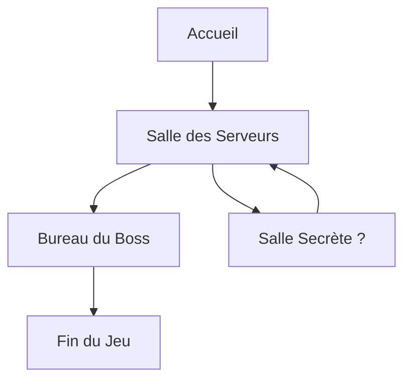

> **Note:**
> Evidemment, vous n'êtes pas limités à 3 niveaux.
> Etant donné la nature labyrinthique de l'exercice, vous pouvez également prévoir des retours en arrière ou des "sauts temporels"

## 🏆 Objectifs pour le Ninja du Clavier

- [ ] Trouver et exploiter au moins 3 vulnérabilités
- [ ] Découvrir le secret ultime caché dans le labyrinthe (indice : ça implique des chats et de la cryptographie, évidemment)
- [ ] Agir avec Humour mais respect (dans la limite du possible)

## 📜 Règles d'Or

1. 🎨 La créativité est votre meilleure arme (après le café, bien sûr)
2. 😂 Riez de vos erreurs, elles sont probablement plus drôles que les blagues du boss
3. 👂 N'oubliez pas : dans ce labyrinthe, même les murs ont des oreilles (et probablement un sens de l'humour douteux)

> **Quote:**
> ☕ *"Je code, donc je suis"* - Descartes (s'il était développeur)

## 📘 Le Carnet de Solutions

Pour chaque vulnérabilité, notez :

| Catégorie | Description |
|-----------|-------------|
| 🎭 Nom de code | Le nom le plus drôle possible |
| 🔍 Découverte | Par pur génie ou par accident ? |
| 🛠️ Exploitation | Plus c'est tordu, mieux c'est |
| 🩹 Correction | Ou pas, si vous voulez garder votre job de testeur |

# 📚 Glossaire

## APT (Advanced Persistent Threat)

**Définition :** Type d'attaque où un attaquant non autorisé accède à un réseau et y reste non détecté pendant une longue période.

**Anecdote :** En 2009, l'opération "Aurora" a été découverte. Des hackers chinois avaient infiltré les systèmes de Google et d'autres grandes entreprises technologiques pendant des mois, volant silencieusement des données sensibles et des secrets commerciaux. Cette attaque a mis en lumière la menace des APT et a conduit à des changements majeurs dans les stratégies de cybersécurité des entreprises.

**Illustration :**
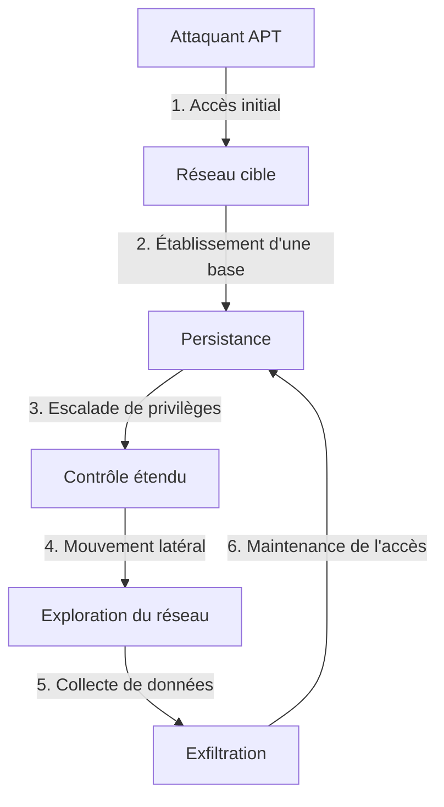

## Backdoor

**Définition :** Point d'accès secret à un système, contournant les mécanismes normaux d'authentification.

**Anecdote :** En 2014, on a découvert que le groupe NSA Equation avait implanté des backdoors dans les firmwares de disques durs de grandes marques comme Western Digital, Seagate et Toshiba. Ces backdoors permettaient à l'agence d'espionnage d'accéder aux données stockées, même si le disque était formaté ou le système d'exploitation réinstallé.

**Illustration :**
```ascii
+-------------------+
|    Application    |
|   +------------+  |
|   |  Backdoor  |  |
|   +------------+  |
+-------------------+
        |
        v
+-------------------+
|      Système      |
+-------------------+
```

## Black Hat

**Définition :** Hacker malveillant qui viole la sécurité informatique pour des gains personnels ou avec des intentions malveillantes.

**Anecdote :** L'un des black hats les plus notoires était Albert Gonzalez. Entre 2005 et 2007, il a dirigé un groupe qui a volé plus de 170 millions de numéros de cartes de crédit et de débit à des entreprises comme TJX Companies et Heartland Payment Systems. Il a été condamné à 20 ans de prison en 2010.

**Illustration :**
```ascii
   _____
  /     \
 /  👿  \
|   ___  |
|  |   | |
|__|___|_|
```

## Blue Team

**Définition :** Groupe de sécurité qui défend une organisation contre les menaces de sécurité.

**Anecdote :** En 2018, lors d'un exercice de cybersécurité organisé par le Département de l'Énergie des États-Unis, l'équipe bleue de l'Idaho National Laboratory a réussi à détecter et à neutraliser une attaque simulée sur un réseau électrique en moins de 2 heures, démontrant l'efficacité d'une équipe bleue bien préparée.

**Illustration :**
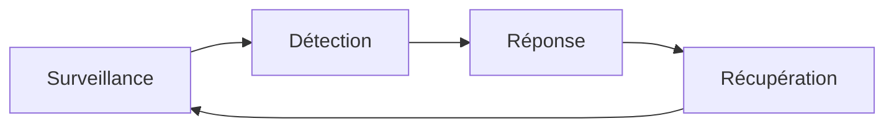

## Botnet

**Définition :** Réseau d'ordinateurs infectés contrôlés à distance par un attaquant.

**Anecdote :** En octobre 2016, le botnet Mirai a été utilisé pour lancer une attaque DDoS massive contre Dyn, un fournisseur DNS majeur. L'attaque a perturbé l'accès à de nombreux sites web populaires comme Twitter, Netflix et Reddit. Ce qui rendait Mirai unique, c'est qu'il était composé principalement d'appareils IoT comme des caméras de sécurité et des routeurs, mettant en lumière les vulnérabilités de l'Internet des objets.

**Illustration :**
```ascii
    C&C Server
        |
   +----+----+
   |    |    |
 Bot1 Bot2 Bot3
```

## Brute Force

**Définition :** Méthode d'attaque consistant à essayer toutes les combinaisons possibles pour trouver un mot de passe ou une clé.

**Anecdote :** En 2012, LinkedIn a subi une attaque par force brute massive. Les hackers ont réussi à compromettre environ 6,5 millions de mots de passe hachés. L'incident a mis en évidence l'importance d'utiliser des techniques de hachage robustes et des politiques de mots de passe forts.

**Illustration :**
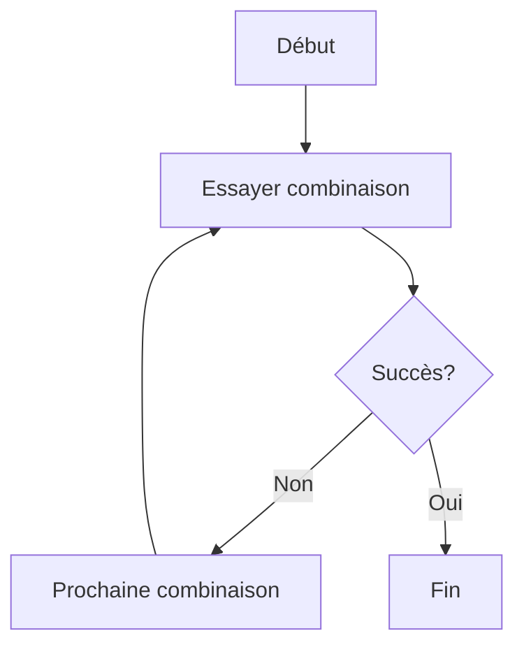

## Buffer Overflow

**Définition :** Vulnérabilité où un programme écrit plus de données dans un tampon qu'il ne peut en contenir.

**Anecdote :** En 1988, le ver Morris, l'un des premiers vers informatiques largement répandus, exploitait une vulnérabilité de débordement de tampon dans le programme fingerd d'Unix. Il a infecté environ 6000 ordinateurs, soit environ 10% d'Internet à l'époque, causant des dommages estimés entre 100 000 et 10 millions de dollars.

**Illustration :**
```ascii
Mémoire:
+---+---+---+---+---+---+
| A | B | C | D | E | F |
+---+---+---+---+---+---+
    ^               ^
    |               |
  Buffer         Overflow
```

## CAPTCHA

**Définition :** Test utilisé pour déterminer si l'utilisateur est un humain ou un bot.

**Anecdote :** En 2014, Google a annoncé que son système reCAPTCHA pouvait être résolu par des machines avec une précision de 99,8%, alors que les humains n'atteignaient que 33%. Cela a conduit à l'introduction de nouvelles formes de CAPTCHA, comme le "Je ne suis pas un robot" à un clic, illustrant l'évolution constante de cette technologie face aux progrès de l'IA.

**Illustration :**
```ascii
+-------------------------+
|  Êtes-vous un humain ?  |
|                         |
|    CAPTCHA ici          |
|    [______________]     |
|                         |
|    [ Je ne suis pas ]   |
|    [   un robot    ]    |
+-------------------------+
```

## Cheval de Troie

**Définition :** Type de malware qui se présente comme un logiciel légitime mais cache des fonctionnalités malveillantes.

**Anecdote :** En 2020, des chercheurs ont découvert un cheval de Troie nommé "EventBot" qui se faisait passer pour une application légitime sur Android. Il ciblait plus de 200 applications financières et de crypto-monnaies, volant les données bancaires et les portefeuilles numériques des utilisateurs. Cet incident a souligné l'importance de la vigilance lors du téléchargement d'applications, même sur des stores officiels.

**Illustration :**
```ascii
   _,._
  /    \
 /  🎁 \   Apparence: Cadeau
| ______ |  Réalité: Malware
|/      \|
```

## Clickjacking

**Définition :** Technique visant à tromper un utilisateur en lui faisant cliquer sur quelque chose d'autre que ce qu'il croit.

**Anecdote :** En 2008, des chercheurs en sécurité ont démontré une attaque de clickjacking sur Adobe Flash Player. Ils ont créé une page web apparemment inoffensive avec un bouton "cliquez ici pour gagner un prix". En réalité, le clic activait la webcam et le microphone de l'utilisateur via Flash, sans son consentement. Cette démonstration a conduit à des améliorations significatives de la sécurité dans les plugins de navigateur.

**Illustration :**
```ascii
+-------------------------+
| Site légitime (visible) |
+-------------------------+
        |
+-------------------------+
|   Couche invisible      |
|   (lien malveillant)    |
+-------------------------+
```

## Cross-Site Request Forgery (CSRF)

**Définition :** Attaque forçant un utilisateur à exécuter des actions indésirables sur une application web où il est authentifié.

**Anecdote :** En 2008, une vulnérabilité CSRF a été découverte dans le routeur Linksys WRT54G. Un attaquant pouvait changer les paramètres DNS du routeur simplement en amenant l'utilisateur à visiter une page web malveillante. Cette faille a potentiellement affecté des millions de routeurs domestiques, soulignant l'importance de la protection contre les CSRF même dans les appareils réseau.

**Illustration :**
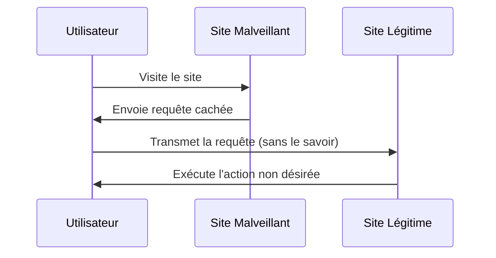

## CTF (Capture The Flag)

**Définition :** Type de compétition de sécurité informatique où les participants doivent trouver des "drapeaux" cachés dans des systèmes vulnérables.

**Anecdote :** Lors du CTF de la conférence DEF CON en 2018, l'équipe gagnante, PPP (Plaid Parliament of Pwning), a réussi à résoudre une série de défis complexes, dont l'exploitation d'une vulnérabilité zero-day, en seulement 24 heures. Leur victoire a démontré l'importance de la pensée créative et des compétences techniques pointues dans le domaine de la cybersécurité.

**Illustration :**
```ascii
+-------------------+
|    CTF Challenges |
|                   |
| [Web] [Crypto]    |
| [Forensics] [PWN] |
|                   |
|   🚩 Flag ici!    |
+-------------------+
```

## DDoS (Distributed Denial of Service)

**Définition :** Attaque visant à rendre un service en ligne indisponible en surchargeant le système avec du trafic provenant de multiples sources.

**Anecdote :** En mars 2013, Spamhaus, une organisation de lutte contre le spam, a été victime de ce qui était alors la plus grande attaque DDoS de l'histoire. Le trafic a atteint un pic de 300 Gbps, suffisant pour ralentir Internet dans certaines parties de l'Europe. L'attaque a mis en lumière la vulnérabilité des infrastructures Internet face à des attaques DDoS massives.

**Illustration :**
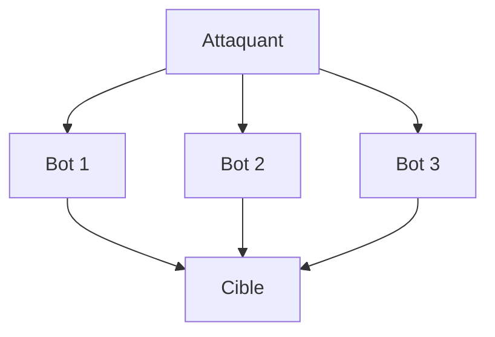

## DNS Spoofing

**Définition :** Attaque où des données DNS corrompues sont introduites dans le cache d'un résolveur DNS.

**Anecdote :** En 2018, des attaquants ont réussi à détourner le trafic destiné à MyEtherWallet, un service populaire de portefeuille de crypto-monnaies, en utilisant le DNS spoofing. Ils ont redirigé les utilisateurs vers un site malveillant qui ressemblait au vrai, volant ainsi environ 160 000 dollars en Ethereum. Cet incident a souligné l'importance de la sécurité DNS et de l'authentification à deux facteurs pour les services financiers en ligne.

**Illustration :**
```ascii
Client ---> Faux DNS ---> Site Malveillant
   ↑          |
   |          |
   +--- Vrai DNS (contourné)
```

## Escalade de privilèges

**Définition :** Exploitation d'une faille pour gagner des droits d'accès plus élevés sur un système.

**Anecdote :** En 2018, une vulnérabilité dans le système d'exploitation iOS (CVE-2018-4241) permettait à une application malveillante d'obtenir des privilèges root, donnant un accès complet au système. Cette faille, découverte par un chercheur en sécurité, a été rapidement corrigée par Apple dans iOS 11.4.1, démontrant l'importance des mises à jour de sécurité régulières.

**Illustration :**
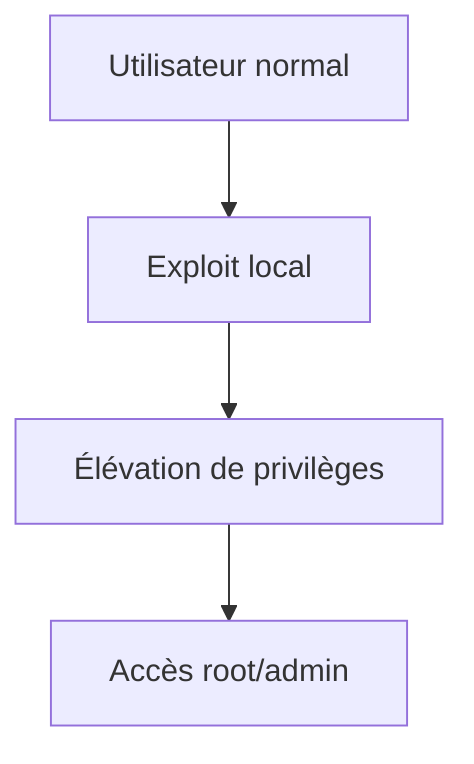

## Exploit

**Définition :** Code qui tire parti d'une vulnérabilité dans un système ou une application.

**Anecdote :** L'exploit EternalBlue, développé par la NSA et divulgué en 2017 par le groupe Shadow Brokers, a été utilisé dans les attaques de ransomware WannaCry et NotPetya. Ces attaques ont affecté des centaines de milliers d'ordinateurs dans le monde, causant des dégâts estimés à des milliards de dollars. Cet incident a soulevé des questions sur le développement et la rétention d'exploits par les agences gouvernementales.

**Illustration :**
```ascii
Vulnérabilité
    |
    v
+----------+
| Exploit  |
+----------+
    |
    v
Système compromis
```

## Firewall

**Définition :** Système de sécurité réseau qui surveille et contrôle le trafic entrant et sortant.

**Anecdote :** En 2003, lors de l'épidémie du ver SQL Slammer, qui a infecté plus de 75 000 serveurs en seulement 10 minutes, les entreprises qui avaient correctement configuré leurs firewalls pour bloquer le port UDP 1434 ont été largement épargnées. Cet événement a démontré l'importance cruciale des firewalls dans la protection des réseaux d'entreprise.

**Illustration :**
```ascii
Internet
   |
+-----+
| 🛡️  |  Firewall
+-----+
   |
Réseau interne
```

## Fuzzing

**Définition :** Technique de test automatisé qui introduit des données invalides, inattendues ou aléatoires dans un système.

**Anecdote :** En 2014, l'outil de fuzzing American Fuzzy Lop a découvert une vulnérabilité critique dans le logiciel de compression bzip2, largement utilisé, qui était passée inaperçue pendant 18 ans. Cette découverte a souligné l'efficacité du fuzzing pour trouver des bugs profondément enfouis dans des logiciels matures et largement utilisés.

**Illustration :**
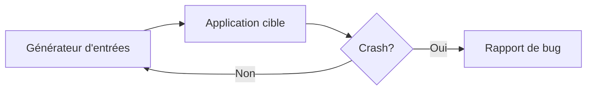

## Hachage

**Définition :** Processus de conversion d'une entrée de longueur arbitraire en une sortie de taille fixe.

**Anecdote :** En 2012, la fuite de 6,5 millions de mots de passe LinkedIn hachés avec SHA-1 sans sel a permis aux attaquants de casser rapidement de nombreux mots de passe. Cet incident a conduit à une adoption plus large de meilleures pratiques de hachage, comme l'utilisation de sels uniques et d'algorithmes plus robustes comme bcrypt.

**Illustration :**
```ascii
Input: "Hello"
    |
    v
+----------+
| Fonction |
|    de    |
| hachage  |
+----------+
    |
    v
Output: "a330bc8f"
```

## Ingénierie sociale

**Définition :** Manipulation psychologique pour amener des personnes à divulguer des informations confidentielles.

**Anecdote :** En 2013, un hacker a réussi à accéder au compte Apple d'un journaliste de Wired, Mat Honan, en utilisant l'ingénierie sociale. L'attaquant a convaincu le support client d'Apple et d'Amazon de fournir suffisamment d'informations pour réinitialiser les mots de passe de Honan, entraînant la perte de années de données personnelles. Cet incident a mis en lumière les vulnérabilités des processus de récupération de compte.

**Illustration :**
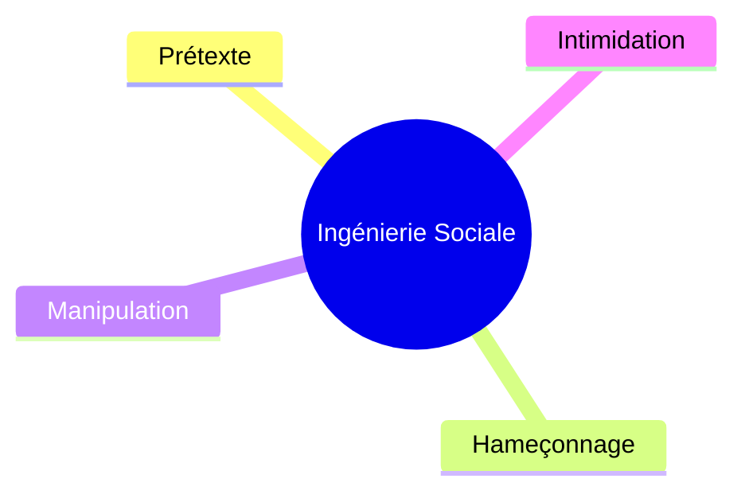

## Injection SQL

**Définition :** Technique d'attaque consistant à insérer du code SQL malveillant dans les requêtes d'une application.

**Anecdote :** En 2015, l'entreprise britannique TalkTalk a subi une attaque par injection SQL qui a compromis les données personnelles de plus de 150 000 clients. L'attaque a été réalisée par un adolescent de 17 ans utilisant un outil d'injection SQL trouvé sur Google. Cet incident a coûté à TalkTalk plus de 60 millions de livres sterling et a souligné l'importance de la validation des entrées utilisateur.

**Illustration :**
```sql
SELECT * FROM users WHERE username = 'input' OR 1=1--' AND password = 'password'
```

## Keylogger

**Définition :** Logiciel ou dispositif qui enregistre les frappes au clavier.

**Anecdote :** En 2017, HP a accidentellement livré des ordinateurs portables contenant un keylogger audio caché dans le pilote audio. Bien qu'il ait été désactivé par défaut, cela aurait pu permettre à un attaquant d'enregistrer les frappes des utilisateurs. HP a rapidement publié un correctif, mais l'incident a soulevé des inquiétudes sur la sécurité de la chaîne d'approvisionnement logicielle.

**Illustration :**
```ascii
+---+---+---+---+
| K | E | Y | S |  Clavier
+---+---+---+---+
      |
      v
+------------+
| Keylogger  |  Enregistre les frappes
+------------+
      |
      v
+------------+
| Attaquant  |
+------------+
```

## Man-in-the-Middle (MITM)

**Définition :** Attaque où l'attaquant s'insère secrètement dans une conversation entre deux parties.

**Anecdote :** En 2011, un pirate iranien a réussi une attaque MITM contre Google en compromettant DigiNotar, une autorité de certification néerlandaise. Il a émis de faux certificats SSL pour google.com, permettant potentiellement l'interception de millions de communications Gmail. Cet incident a conduit à la faillite de DigiNotar et à des changements majeurs dans le système de confiance des certificats SSL.

**Illustration :**
```ascii
Alice <---> Attaquant <---> Bob
```

## Metasploit

**Définition :** Framework open-source pour développer, tester et exécuter des exploits.

**Anecdote :** En 2009, Metasploit a été utilisé pour démontrer une vulnérabilité dans les iPhone lors de la conférence Black Hat. Les chercheurs ont montré comment prendre le contrôle total d'un iPhone simplement en envoyant un SMS malformé. Cette démonstration a conduit Apple à publier rapidement un correctif et a souligné l'importance de Metasploit comme outil de test de sécurité.

**Illustration :**
```ascii
+--------------------+
|     Metasploit     |
|                    |
| [Exploits] [Payloads] |
| [Encoders] [Nops]  |
| [Auxiliary]        |
+--------------------+
```

## Nmap

**Définition :** Outil de scan de réseau et d'audit de sécurité.

**Anecdote :** En 2013, un administrateur système a utilisé Nmap pour scanner le réseau d'une grande banque et a accidentellement déclenché une panne généralisée des DAB. L'incident a mis en évidence la puissance de Nmap et l'importance de l'utiliser avec précaution dans les environnements de production.

**Illustration :**
```ascii
Nmap Scan
  |
  +-- Port 80 (HTTP): Ouvert
  |
  +-- Port 443 (HTTPS): Ouvert
  |
  +-- Port 22 (SSH): Filtré
```

## Payload

**Définition :** Partie d'un malware qui exécute une action malveillante.

**Anecdote :** Le ver Stuxnet, découvert en 2010, contenait un payload complexe spécifiquement conçu pour saboter les centrifugeuses nucléaires iraniennes. Il a réussi à endommager environ un cinquième des centrifugeuses de l'Iran, retardant significativement son programme nucléaire. Cet incident a marqué la première cyberattaque connue ciblant des infrastructures physiques.

**Illustration :**
```ascii
+-------------------+
| Malware           |
|  +--------------+ |
|  |   Payload    | |
|  | (Code malveillant) |
|  +--------------+ |
+-------------------+
```

## Phishing

**Définition :** Tentative d'obtenir des informations sensibles en se faisant passer pour une entité de confiance.

**Anecdote :** En 2016, John Podesta, le directeur de campagne d'Hillary Clinton, a cliqué sur un lien de phishing dans un email prétendument envoyé par Google, demandant de changer son mot de passe. Cette action a conduit à la compromission de son compte et à la fuite de milliers d'emails de campagne, influençant potentiellement l'élection présidentielle américaine de 2016.

**Illustration :**
```ascii
+----------------------+
| De: bank@example.com |
| Objet: Urgent!       |
|                      |
| Cher client,         |
| Cliquez ici pour     |
| vérifier votre compte|
|                      |
| [Lien malveillant]   |
+----------------------+
```

## Ransomware

**Définition :** Type de malware qui chiffre les fichiers d'un utilisateur et demande une rançon pour les déchiffrer.

**Anecdote :** En mai 2017, le ransomware WannaCry a infecté plus de 230 000 ordinateurs dans 150 pays en seulement 24 heures. Il a notamment perturbé le système de santé britannique (NHS), forçant l'annulation de milliers de rendez-vous médicaux. Cette attaque a causé des dommages estimés à plusieurs milliards de dollars et a mis en lumière la vulnérabilité des systèmes non mis à jour.

**Illustration :**
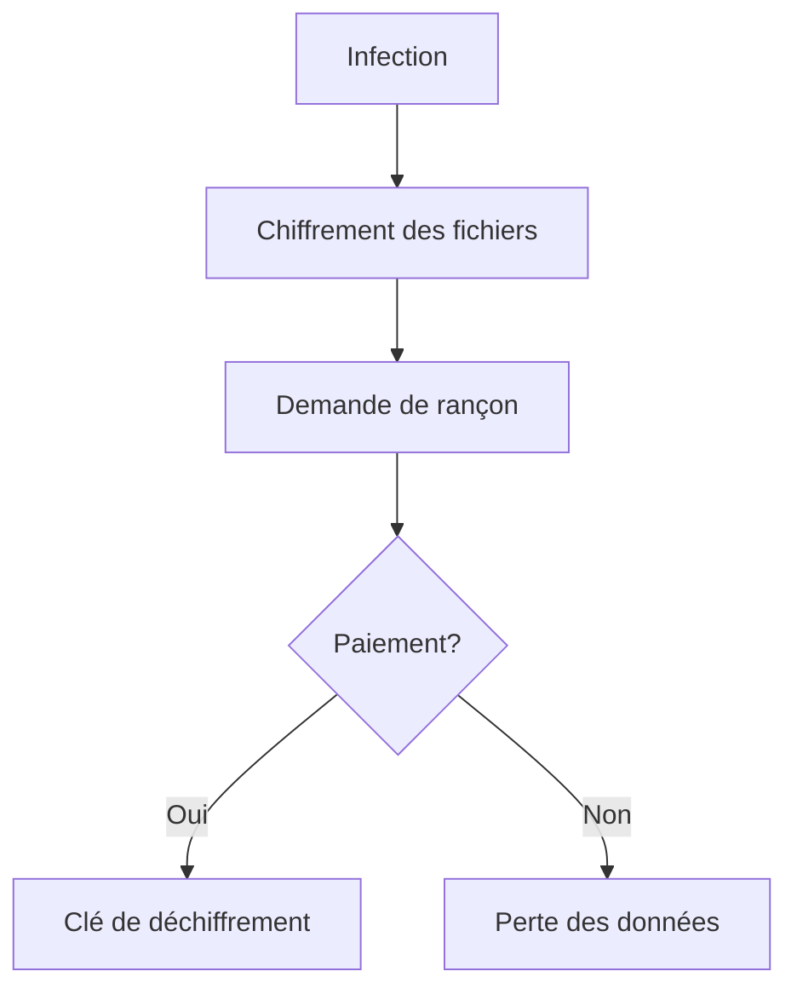

## Red Team

**Définition :** Groupe qui joue le rôle d'un adversaire pour tester la sécurité d'une organisation.

**Anecdote :** En 2014, une équipe rouge engagée par une grande banque américaine a réussi à pénétrer physiquement dans le centre de données principal de la banque en se faisant passer pour des techniciens de climatisation. Ils ont ensuite connecté des dispositifs cachés au réseau, démontrant des failles critiques dans la sécurité physique et numérique de la banque.

**Illustration :**
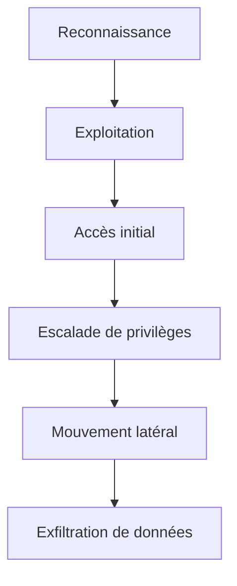

## Reverse Engineering

**Définition :** Processus d'analyse d'un système pour identifier ses composants et leurs relations.

**Anecdote :** En 2010, des chercheurs ont fait du reverse engineering sur le ver Stuxnet, révélant sa complexité et son objectif spécifique de cibler les systèmes de contrôle industriels iraniens. Cette analyse a permis de comprendre les capacités avancées de cette cyberarme et a soulevé des questions sur l'implication d'états nations dans le cyberespace.

**Illustration :**
```ascii
Logiciel compilé
      |
      v
+------------+
| Désassemblage |
+------------+
      |
      v
+------------+
| Analyse    |
+------------+
      |
      v
Code source reconstruit
```

## Rootkit

**Définition :** Collection de logiciels conçus pour permettre l'accès à un ordinateur tout en masquant sa présence.

**Anecdote :** En 2005, Sony BMG a secrètement installé un rootkit sur les ordinateurs des clients via des CD audio, dans le but de prévenir la copie illégale. Lorsque cela a été découvert, cela a conduit à un scandale majeur et à des poursuites judiciaires. Le rootkit rendait les ordinateurs vulnérables à d'autres attaques, forçant Sony à rappeler des millions de CD et à offrir des remboursements.

**Illustration :**
```ascii
+-------------------+
|  Système          |
|   +-----------+   |
|   |  Rootkit  |   |
|   | (caché)   |   |
|   +-----------+   |
+-------------------+
```

## Sandbox

**Définition :** Environnement de test isolé pour exécuter du code potentiellement dangereux.

**Anecdote :** En 2015, des chercheurs en sécurité ont découvert une vulnérabilité dans la sandbox de Google Chrome permettant à un attaquant de s'échapper de l'environnement isolé et d'exécuter du code arbitraire sur le système hôte. Google a rapidement corrigé cette faille, soulignant l'importance continue des mises à jour de sécurité, même pour les systèmes réputés sûrs.

**Illustration :**
```ascii
+---------------------+
|    Environnement    |
|      d'exécution    |
|  +---------------+  |
|  |   Sandbox    |  |
|  | +----------+ |  |
|  | | Programme| |  |
|  | +----------+ |  |
|  +---------------+  |
+---------------------+
```

## Script Kiddie

**Définition :** Personne inexpérimentée qui utilise des scripts ou programmes existants pour attaquer des systèmes.

**Anecdote :** En 2000, Michael Calce, un adolescent canadien connu sous le pseudo "MafiaBoy", a lancé une série d'attaques DDoS contre des sites majeurs comme Yahoo, CNN, eBay et Amazon, causant des dommages estimés à 1,7 milliard de dollars. Il utilisait des outils préfabriqués trouvés en ligne, illustrant parfaitement le concept de script kiddie et les dégâts potentiels qu'ils peuvent causer.

**Illustration :**
```ascii
Script Kiddie
     |
  +--+--+
  |     |
Outils  Tutoriels
préfabriqués
```

## Sniffing

**Définition :** Interception et analyse du trafic réseau.

**Anecdote :** En 2007, l'attaque TJX, l'une des plus grandes violations de données de l'histoire, a commencé par du sniffing de réseau Wi-Fi. Les attaquants ont intercepté des transactions de cartes de crédit non chiffrées dans deux magasins Marshalls, leur permettant ensuite de compromettre l'ensemble du réseau de TJX et de voler les données de 45 millions de cartes de crédit.

**Illustration :**
```ascii
+--------+     +--------+
| Client |<--->| Switch |<--->| Server |
+--------+     +--------+     +--------+
                  ^
                  |
             +--------+
             | Sniffer|
             +--------+
```

## Social Engineering

**Définition :** Manipulation psychologique visant à obtenir des informations confidentielles.

**Anecdote :** En 2015, un hacker a réussi à obtenir l'accès au compte iCloud de John Brennan, alors directeur de la CIA, simplement en se faisant passer pour un employé de Verizon au téléphone. Il a convaincu le support client de Verizon de lui fournir des informations personnelles de Brennan, qu'il a ensuite utilisées pour réinitialiser le mot de passe du compte iCloud.

**Illustration :**
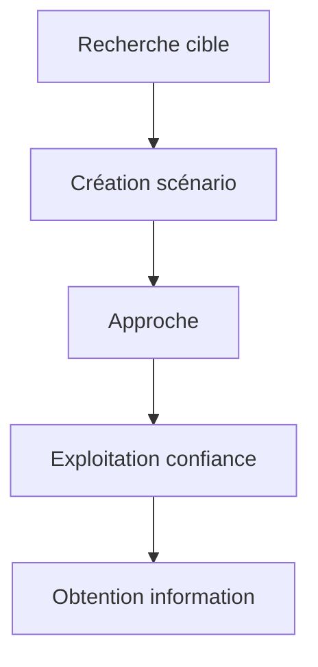

## Spear Phishing

**Définition :** Attaque de phishing ciblée sur une personne ou une organisation spécifique.

**Anecdote :** En 2011, RSA Security, connue pour ses jetons d'authentification à deux facteurs, a été victime d'une attaque de spear phishing. Un email apparemment anodin avec une pièce jointe Excel a été envoyé à un petit groupe d'employés. L'ouverture de ce fichier a conduit à l'installation d'un malware, permettant aux attaquants de compromettre le réseau de RSA et de voler des informations sur les produits de sécurité de l'entreprise.

**Illustration :**
```ascii
   Cible spécifique
         |
         v
+-------------------+
| Email personnalisé|
|                   |
| Cher [Nom],       |
| En tant que [Poste],|
| ...               |
+-------------------+
```

## Spoofing

**Définition :** Usurpation d'identité dans le but de tromper des systèmes ou des utilisateurs.

**Anecdote :** En 2013, un groupe de hackers a utilisé le spoofing d'email pour tromper le personnel de l'Associated Press (AP) et prendre le contrôle du compte Twitter de l'AP. Ils ont ensuite publié un faux tweet sur une explosion à la Maison Blanche, provoquant une chute temporaire de 143 points de l'indice Dow Jones et effaçant 136 milliards de dollars de valeur de marché en quelques minutes.

**Illustration :**
```ascii
+----------+     +----------+
| Attaquant| --> | Victime  |
+----------+     +----------+
     ^
     |
  IP forgée
```

## Stéganographie

**Définition :** Art de cacher des informations dans d'autres données ou fichiers.

**Anecdote :** En 2010, le FBI a arrêté un réseau d'espions russes aux États-Unis qui utilisait la stéganographie pour cacher des messages secrets dans des images publiées sur des sites web publics. Les agents échangeaient des informations en utilisant des photos apparemment anodines sur des sites comme Picasa, démontrant l'utilisation sophistiquée de cette technique dans l'espionnage moderne.

**Illustration :**
```ascii
+----------------+
|   Image JPEG   |
| +------------+ |
| |Message caché| |
| +------------+ |
+----------------+
```

## Threat Intelligence

**Définition :** Données analysées sur les menaces potentielles ou actuelles visant une organisation.

**Anecdote :** En 2014, grâce à la threat intelligence partagée par le FBI, Home Depot a découvert qu'il était victime d'une violation de données massive. Cette information a permis à l'entreprise de réagir rapidement, mais malheureusement, 56 millions de numéros de cartes de crédit avaient déjà été compromis. Cet incident a souligné l'importance du partage d'informations sur les menaces entre les secteurs public et privé.

**Illustration :**
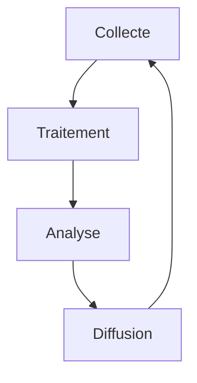

## Virus

**Définition :** Programme malveillant qui se réplique en s'insérant dans d'autres programmes.

**Anecdote :** Le virus "I Love You" de 2000 s'est propagé via des emails avec le sujet "ILOVEYOU" et une pièce jointe "LOVE-LETTER-FOR-YOU.TXT.vbs". Il a infecté des millions d'ordinateurs en quelques heures, causant des dégâts estimés à 10 milliards de dollars. Ce virus a démontré la puissance de l'ingénierie sociale combinée à la propagation virale.

**Illustration :**
```ascii
Fichier sain
    |
    v
+----------+
|  Virus   |
+----------+
    |
    v
Fichiers infectés
```

## VPN (Virtual Private Network)

**Définition :** Technologie créant une connexion chiffrée sur un réseau moins sûr.

**Anecdote :** En 2018, lorsque la Chine a bloqué WhatsApp, de nombreux utilisateurs ont utilisé des VPN pour contourner la censure et continuer à utiliser l'application. En réponse, le gouvernement chinois a intensifié sa répression sur les VPN, allant jusqu'à condamner un homme à plus de 5 ans de prison pour avoir vendu des services VPN, illustrant les enjeux géopolitiques liés à cette technologie.

**Illustration :**
```ascii
Client +----Tunnel chiffré----+ Serveur VPN +----+ Internet
```

## Wardriving

**Définition :** Acte de rechercher des réseaux WiFi depuis un véhicule en mouvement.

**Anecdote :** En 2010, Google a admis que ses voitures Street View avaient accidentellement collecté des données de réseaux Wi-Fi non sécurisés lors de leurs tournées photographiques. Bien que non intentionnel, cet incident a été considéré comme du wardriving à grande échelle et a conduit à des enquêtes dans plusieurs pays sur les pratiques de collecte de données de Google.

**Illustration :**
```ascii
  +--------+
  |Véhicule|
  |  WiFi  |
  |Antenna |
  | Laptop |
  +--------+
      |
      v
Réseaux détectés
```

## White Hat

**Définition :** Hacker éthique qui teste la sécurité avec la permission du propriétaire du système.

**Anecdote :** En 2015, le hacker white hat Laxman Muthiyah a découvert une faille dans Facebook permettant de supprimer n'importe quelle photo d'un utilisateur sans son consentement. Il l'a signalée à Facebook dans le cadre de leur programme de prime aux bogues et a reçu une récompense de 12 500 dollars. Cette découverte a permis à Facebook de corriger rapidement la vulnérabilité, protégeant ainsi la vie privée de millions d'utilisateurs.

**Illustration :**
```ascii
   _____
  /     \
 /  😇  \
|   ___  |
|  |   | |
|__|___|_|
 Ethical Hacker
```

## Worm

**Définition :** Malware auto-répliquant qui se propage à travers les réseaux.

**Anecdote :** En 2003, le ver SQL Slammer a infecté plus de 75 000 serveurs en seulement 10 minutes, causant des perturbations massives d'Internet. Il exploitait une vulnérabilité dans Microsoft SQL Server et générait un tel volume de trafic qu'il a provoqué des pannes de réseau dans le monde entier, y compris l'arrêt du système de guichets automatiques de la Bank of America.

**Illustration :**
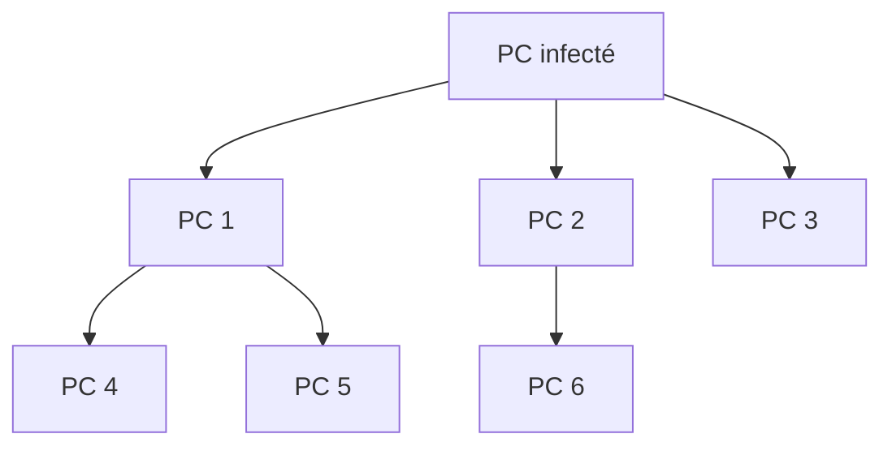

## XSS (Cross-Site Scripting)

**Définition :** Vulnérabilité web permettant l'injection de code côté client.

**Anecdote :** En 2005, le ver Samy a exploité une vulnérabilité XSS sur MySpace, infectant plus d'un million de profils en moins de 24 heures. Chaque profil infecté affichait le message "Samy is my hero" et ajoutait automatiquement Samy comme ami. Cette attaque, bien que relativement inoffensive, a démontré le potentiel de propagation rapide des attaques XSS sur les réseaux sociaux.

**Illustration :**
```ascii
Attaquant --> Site web vulnérable
                    |
                    v
              Utilisateur victime
```

## Zero-Day

**Définition :** Vulnérabilité inconnue du fabricant du logiciel et du public, potentiellement déjà exploitée par des attaquants.

**Anecdote :** En 2010, le ver Stuxnet a utilisé quatre vulnérabilités zero-day différentes pour infecter et saboter les systèmes de contrôle industriels iraniens. Cette cyberattaque sophistiquée, supposément menée par les États-Unis et Israël, a démontré le pouvoir destructeur des exploits zero-day et a marqué l'entrée dans une nouvelle ère de cyberguerre.

**Illustration :**
```ascii
Discovery   Exploit   Patch
    |          |        |
    v          v        v
----+----------+--------+---->
    ^                   ^
    |                   |
Vulnerability        Fix released
   found
```


## ❓ FAQ

1. **Q: Puis-je participer seul ?**
   **R:** Le CTF est conçu pour être joué en binôme, mais rien ne vous empêche de relever le défi en solo !

2. **Q: Y a-t-il une limite de temps ?**
   **R:** Non, prenez le temps qu'il vous faut. L'important est d'apprendre et de s'amuser.

3. **Q: Où puis-je trouver plus de ressources sur la cybersécurité ?**
   **R:** Voici quelques liens utiles :
   - [OWASP](https://owasp.org/)
   - [HackTheBox](https://www.hackthebox.eu/)
   - [TryHackMe](https://tryhackme.com/)

## 🎉 Conclusion

Que le meilleur binôme gagne ! Et rappelez-vous, dans le monde de la cybersécurité, le ridicule ne tue pas, mais il peut certainement compromettre un système entier !

---

<div align="center">
  
  <p><em>Bonne chance, et que la force du code soit avec vous !</em></p>
</div>
